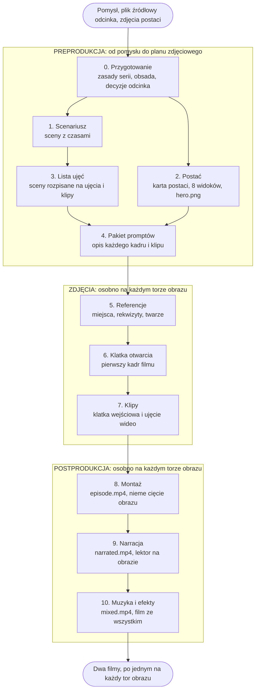

# Jak to powstaje

Ta strona jest dla osoby, która zna produkcję wideo i nie musi znać kodu. Opisuje, co
narzędzie robi po kolei, czego każdy etap potrzebuje i co oddaje.

Krótko: jedenaście etapów w trzech fazach. Każdy zostawia na dysku plik, a następny rusza
dopiero wtedy, gdy człowiek ten plik obejrzał i się na niego zgodził.

## Cała produkcja na jednym obrazku

Dwie rzeczy, których na obrazku nie widać:

- **Między każdymi dwoma etapami stoi projekcja i podpis.** Strzałka znaczy, że ktoś ten
  plik obejrzał i puścił go dalej.
- **Od etapu 2 wszystko dzieje się dwa razy.** Jeden scenariusz, dwa modele rysujące, dwa
  komplety obrazów, dwa filmy na końcu.

## Preprodukcja

Faza tekstu i projektu. Powstaje tu wszystko, co trzeba wymyślić, zanim ktokolwiek zacznie
rysować kadry. To jedyne miejsce, w którym zmiana kosztuje mało.

### 0. Przygotowanie

Development i biblia serii. Jedyny etap, który wolno karmić materiałem z zewnątrz: zdjęcia
postaci, plik z opowiadaniem, ustalenia o świecie. Wszystko, co wchodzi, jest kopiowane do
środka razem z sumą kontrolną, więc później widać, z czego dokładnie wyszedł film.

- **Potrzebuje:** Twojego pomysłu, pliku źródłowego odcinka, zdjęć albo opisów postaci.
- **Produkuje:** zasady serii, obsadę i decyzje odcinka: długość, format, język, tryb dźwięku.
- **Koszt:** darmowy.
- [Komendy tego etapu](stages/00-przygotowanie.md)

### 1. Scenariusz

Pierwszy etap, który wydaje pieniądze, i pierwszy, który odmawia startu, dopóki etap 0 nie
jest zatwierdzony.

- **Potrzebuje:** zatwierdzonych zasad serii i pliku źródłowego.
- **Produkuje:** `screenplay.md`, czyli sceny z czasami, dialogiem i opisem tego, co słychać.
- **Koszt:** jedno wywołanie modelu tekstowego.
- [Komendy tego etapu](stages/01-scenariusz.md)

### 2. Postać

Projekt postaci i charakteryzacja. Nie czeka na scenariusz, bo postać opisuje serię, a nie
odcinek, więc może biec równolegle do etapu 1. Jest też pierwszym etapem rysowanym, czyli
pierwszym, który robi się osobno na każdym torze obrazu.

- **Potrzebuje:** zasad serii oraz zdjęć albo opisu postaci.
- **Produkuje:** kartę postaci, 8 widoków i `hero.png`, dla każdej postaci i każdego toru.
- **Koszt:** do dziesięciu obrazów na postać i tor.
- [Komendy tego etapu](stages/02-postac.md)

### 3. Lista ujęć

Odpowiednik scenopisu i planu zdjęciowego: scenariusz rozpisany na ujęcia, a ujęcia na
klipy, które faktycznie da się wyrenderować.

- **Potrzebuje:** zatwierdzonego scenariusza.
- **Produkuje:** `shot-list.md`, czyli sceny, ujęcia i klipy z czasami i opisem dźwięku.
- **Koszt:** jedno wywołanie modelu tekstowego.
- [Komendy tego etapu](stages/03-lista-ujec.md)

### 4. Pakiet promptów

Karta zdjęciowa każdego kadru: jeden opis na każde przyszłe wywołanie modelu obrazu i wideo.
Pierwszy etap, który łączy stronę tekstową z rysowaną, więc czeka i na listę ujęć, i na to,
żeby każda postać z tej listy miała gotowe `hero.png` **na obu torach**.

- **Potrzebuje:** zatwierdzonej listy ujęć i zatwierdzonych postaci na obu torach.
- **Produkuje:** manifest i po jednym pliku promptu na każdy przyszły kadr i klip.
- **Koszt:** jedno wywołanie modelu tekstowego.
- [Komendy tego etapu](stages/04-pakiet-promptow.md)

## Zdjęcia

Faza, w której powstają obrazy. Od tego miejsca wszystko biegnie dwa razy, osobno na każdym
torze, i kończy się dwoma niezależnymi kompletami materiału.

### 5. Referencje

Scenografia i rekwizyty: miejsca, przedmioty i twarze drugiego planu, które muszą wyglądać
tak samo w każdym ujęciu, w którym się pojawią.

- **Potrzebuje:** zatwierdzonego pakietu promptów.
- **Produkuje:** `references/Rxx.png`, po jednym obrazie na rzecz widzianą więcej niż raz.
- **Koszt:** kilka obrazów; polecenie mówi ile, zanim kupi pierwszy.
- [Komendy tego etapu](stages/05-referencje.md)

### 6. Klatka otwarcia

Pierwszy kadr filmu i jedyny, który powstaje z samego opisu. Wszystkie następne wychodzą
z klatki poprzednika, więc ten jeden ustawia światło i paletę całego odcinka.

- **Potrzebuje:** zatwierdzonych referencji, które ten kadr wymienia.
- **Produkuje:** `opening-frame.png`.
- **Koszt:** jeden obraz.
- [Komendy tego etapu](stages/06-klatka-otwarcia.md)

### 7. Klipy

Zdjęcia właściwe, ujęcie po ujęciu. Każdy klip zaczyna się dokładnie tam, gdzie skończył
się poprzedni: najpierw powstaje klatka wejściowa, potem ruch z niej wyprowadzony. Łańcuch
idzie od początku filmu do końca i każde ogniwo wymaga osobnej zgody.

- **Potrzebuje:** zatwierdzonej ostatniej klatki poprzedniego klipu.
- **Produkuje:** `clips/Cxx.mp4` razem z klatkami wejściową i końcową.
- **Koszt:** obrazy **i** wideo; to najdroższy etap produkcji.
- [Komendy tego etapu](stages/07-klipy.md)

## Postprodukcja

Faza sklejania. Nic się tu już nie rysuje, a dwa z trzech etapów niczego nie kupują, bo
liczy je lokalny ffmpeg.

### 8. Montaż

- **Potrzebuje:** wszystkich zatwierdzonych klipów tego toru.
- **Produkuje:** `episode.mp4`, czyli nieme cięcie obrazu.
- **Koszt:** darmowy; sklejenie robi ffmpeg, bez przekodowania.
- [Komendy tego etapu](stages/08-montaz.md)

### 9. Narracja

Lektor. Tekst pochodzi ze scenariusza i listy ujęć, a walidator sprawdza, czy każde zdanie
faktycznie stamtąd pochodzi. `narrated.mp4` jest jedyną wersją, w której słychać samo
umieszczenie narracji, bez muzyki pod spodem, i dlatego jest osobnym plikiem do obejrzenia.

- **Potrzebuje:** zatwierdzonej listy ujęć, obsadzonego głosu i zatwierdzonego montażu.
- **Produkuje:** `narration/Nnn.wav` i `narrated.mp4`.
- **Koszt:** rozliczany w znakach tekstu, który dostaje lektor.
- [Komendy tego etapu](stages/09-narracja.md)

### 10. Muzyka i efekty

Udźwiękowienie i mix. Muzyka oraz efekty są kupowane, a nie przynoszone z zewnątrz, i kładą
się na niemym cięciu razem z narracją. Dzięki temu mowa jest kodowana raz, a podkład może
uczciwie ustąpić pod głosem.

- **Potrzebuje:** zatwierdzonej listy ujęć i zatwierdzonego `narrated.mp4`.
- **Produkuje:** `sound/*.mp3` i `mixed.mp4`, czyli film ze wszystkim.
- **Koszt:** rozliczany w sekundach wygenerowanego dźwięku.
- [Komendy tego etapu](stages/10-muzyka-i-efekty.md)

## Projekcja i podpis

Każdy etap ma dwie osobne rzeczy: sprawdzenie i akceptację.

**Sprawdzenie** czyta pliki i mówi, czy są kompletne i poprawne. Niczego nie zapisuje i nie
jest zgodą. **Akceptacja** jest miejscem, w którym człowiek mówi „tak", i wiąże tę zgodę
z konkretnymi bajtami. Podmiana pliku poza narzędziem ją unieważnia, a sprawdzenie to
zgłasza.

Dzięki temu pomyłka kosztuje jeden etap. Zła twarz postaci zatrzymuje się na etapie 2 i nie
trafia do stu kadrów, bo etap 4 nie ruszy bez zatwierdzonej postaci.

Nic nie ponawia się samo. Płatne polecenie mówi, ile wywołań wykona, zanim je wykona, i ma
tryb, który pokazuje pełny prompt bez sięgania po klucz.

## Dlaczego dwa filmy

Od pierwszego rysowanego etapu materiał rozdziela się na **dwa tory obrazu**, czyli dwa
różne modele rysujące ten sam scenariusz. Każdy tor ma własne postacie, własne referencje,
własne klipy, własny montaż i własny mix.

Tekst jest wspólny, bo scenariusz, lista ujęć i pakiet promptów opisują historię, a nie
obrazy, więc powstają raz. Rozejście zaczyna się tam, gdzie zaczyna się rysowanie, i kończy
dwoma gotowymi filmami, które można postawić obok siebie i wybrać.

Gotowy odcinek w obu torach pokazuje [aimator.auditmos.com](https://aimator.auditmos.com/).

## Dalej

- [README.md](../README.md): tabela etapów z linkami do komend i wymagania startowe
- [docs/pipeline.md](pipeline.md): pełny kontrakt, czyli niezmienniki, kształt plików stanu
  i szczegóły walidacji
- [docs/konfiguracja.md](konfiguracja.md): zmienne środowiskowe, z uzasadnieniem każdej
